## Motivation and Background

```{r}
library(tidyverse)
```

Data visualizations play an essential role in understanding patterns in the structure of data. They allow for a programmatic mapping of data into a "picture" that can be used to gather insight from the viewer [@tukey1965; @tufte2001; @wilkinson2005]. Since the early 20th century, researchers have been exploring the question: what makes a good graph? [@croxton1927; @croxton1932; @cleveland1984; @vanderplas2020]. Many attempts to answer this question have provided good recommendations, but are largely limited to the projection of graphs onto 2-dimensional (2D) surfaces. While this addresses many of the typical use cases for data visualizations, the process of creating modern statistical graphics in our 3-dimensional (3D) world is a relatively new phenomenon that does not have widespread usage [@huronMakingDataPhysical2023].

Many charts exist within the confines of a 2D projected space due to the practicality of computer renderings. These computer-generated graphics are quick and cheap to produce [@tukey1965], which possibly contributes to their widespread usage. Before computers, hand-drawn and complex printing techniques were common production methods and took time to produce [@friendly2021; @vanderplas2019]. In contrast, all data physicalizations require additional material resources, increasing the base cost to produce. Additionally, there are few modern resources that have direct pipelines from data to physical objects. One such example is the `rayshader` package [@rayshader], although modifications to the resulting stereolithography (STL) file or OBJ file are needed before physicalization can take place. The cost and lack of tools for producing physical charts likely results in the majority of modern graphics being produced with 2D representations on digital screens.

Nearly every type of chart can be created by using a programmatic mapping of data and variables to aesthetics and geometries, a process sometimes referred to as the "Grammar of Graphics" [@wilkinson2005]. This has found widespread implementation into numerous software [@wickham2010; @satyanarayan2017; @sas9.4]. For example, consider the chart created in @fig-quick-plot. In this figure, the Palmer Penguins dataset [@penguins] is supplied to the `ggplot` function from the `ggplot2` package [@ggplot2]. The x and y axes are mapped to bill length and bill depth, with color and shape being mapped to island. The geometry is given by `geom_point`, which results in a scatterplot that shows each complete data observation. Although the chart would benefit from further customization, it was quick to produce and has instant visual insights. Other software packages can create the same chart using a similar process by specifying the axes, colors, and shapes using a point geometry.

\newpage

```{r}
#| label: fig-quick-plot
#| fig-cap: "Penguins dataset [@penguins] showing the construction of a plot using `ggplot2` in R."
#| fig-scap: "Grammar of graphics example"
#| echo: true
#| eval: true


library(tidyverse)
library(palmerpenguins)
ggplot(penguins, mapping = aes(x = bill_length_mm, 
                               y = bill_depth_mm, 
                               color = island, 
                               shape = island)) + 
  geom_point()
```


While there have been many attempts to establish good data visualization practices [@tufte2001; @vanderplas2020], we do not know how well these recommendations translate from 2D projections into our 3D world. The advent of 3D printing allows us to precisely construct the 3D charts that have been widely studied through their 2D representations [@croxton1932; @barfield1989; @zacks1998]. With limited research on 3D-printed data manifestations, we explore some of the first empirical findings of physical 3D statistical graphics.

## Overview of Physical 3D Visualizations

Data can be expressed in the physical world through a wide variety of means. In many cases, this can take on artistic expressions, such as encoding information into crocheted blankets or wooden sculptures [@huronMakingDataPhysical2023]. While certainly providing information about the data, these informational art pieces are largely left as display items to promote conversation into the underlying dataset.

![3D-printed treemap created displaying Gross National Income for 130 countries [@huronMakingDataPhysical2023, pg. 217]. The two 3D prints on the bottom have additional information overlaid on top of the treemap as 2D displays.](images/treemap-3d.png){#fig-3d-treemap fig-scap='3D-printed treemap' width=80%}

Perhaps one of the most affordable types of data physicalization is through the use of 3D printing. Aside from the startup cost of a 3D-printer, material and labor costs are relatively low. Rolls of PLA filament can be acquired for around \$20 and can be used to create multiple charts. Print times vary depending on the size and complexity of the graphic, but smaller charts can be produced in approximately 2 hours. While needing much more time to produce than computer-generated visualizations, the amount of hands-on labor during the 3D-printing process is mainly limited to the time it takes to create the print file.

Using 3D printers to create statistical graphics has typically been reserved for niche purposes to promote engagement of the displayed data. One of the earliest 3D-printed charts was shared in 2014 by the Wall Street Journal, where the print was used to discuss the rising popularity of 3D printers [@graphicsHowDoes3D; @thingiversecomChartSales3D]. It is rare to find these types of charts in practice, where images of the charts are often posted to social media or blog posts. This results in limited access to the physical charts, even though source print files can be shared through sites such as [thingiverse.com](thingiverse.com) and [printables.com](printables.com), as well as through GitHub. 

::: {#fig-wsj layout-nrow="2" fig-cap="3D-printed volume charts showing the sales of 3D printers under \$5,000 [@thingiversecomChartSales3D]." fig-scap="First 3D-printed statistical graphic"}
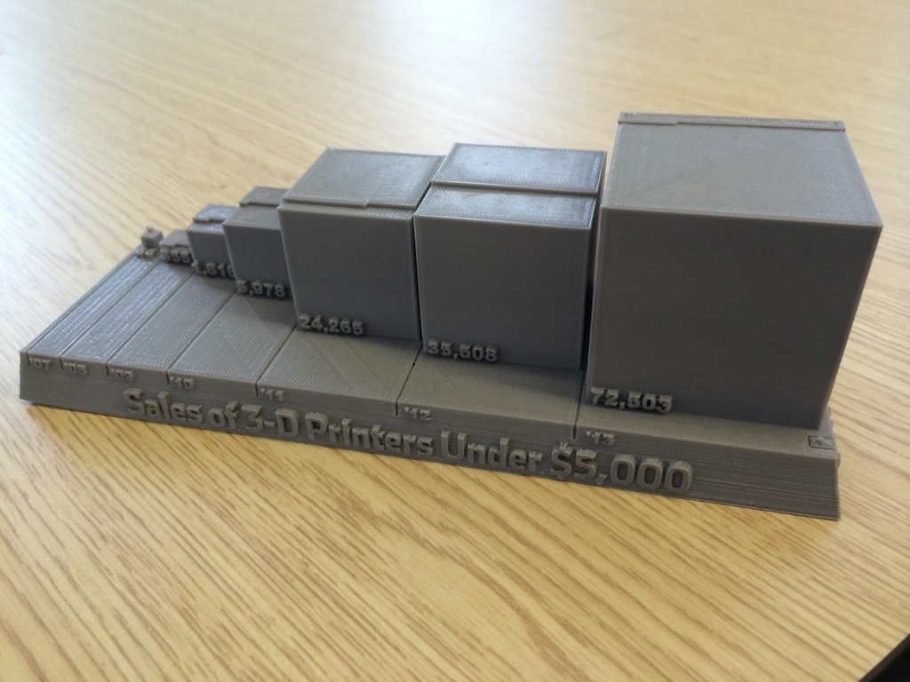{#fig-wsj-orig height="2in" fig-scap='Original WSJ 3D print'}

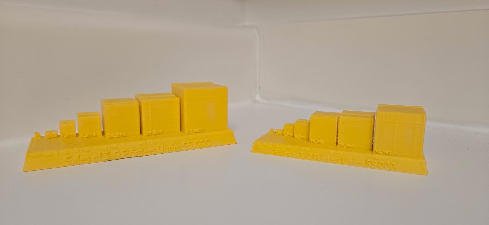{#fig-wsj-myprint height="2in" fig-scap='Replicated WSJ 3D print'}

@fig-wsj-orig shows the original WSJ print from 2014. @fig-wsj-myprint shows two prints created with a Flash Forge Finder 3D Printer, where the smaller chart took 2 hours to print and the larger chart took 6 hours to print.
:::

### Creating 3D-Printed Visualizations

The popularity of the 3D printer exploded in the early 2010s as the technology became increasingly available and cheaper. This has led to increased use of 3D printing in many focus areas, including healthcare [@dodziuk2016] and engineering [@v2023], but has seen only limited use for statistical graphics. The creation of 3D-printed statistical graphics involves generating an STL file and using it within 3D printing software to produce the final print file. This file can then be transferred to a 3D printer, where the chart can be materialized. Many software programs have the ability to create 3D statistical graphics, but lack the ability to easily export the graphics into files suitable for 3D printing.

Numerous software programs can create digital renderings of 3D charts. Excel [@msexcel] has native support for creating charts with 3D depth cues, but requires add-ins to produce charts using 3 axes. R [@r] has several options for creating 3D charts that have data on 3 axes [e.g., @rgl; @rayshader; @plotly], but lacks support for creating depth charts. SAS 9.4 [@sas9.4] has options such as PROC GCHART for adding depth cues and PROC G3D for surface charts. Other popular software programs contain similar capabilities, such as JavaScript libraries, MATLAB, and Python.

While a number of tools exist for creating 3D data visualizations, the pipeline of getting these charts into files compatible with 3D printing is not widely automated. For example, R has some options using the `rgl` [@rgl] and `rayshader` [@rayshader] packages, but both packages have limited tuning parameters for their output files. Another option is to use 3D software, such as OpenSCAD [@kintelOpenSCADDocumentation2023], to manually create the charts, but these software programs lack the ability to directly integrate statistical information in the formulation of the charts. Without easy tools for creating 3D print files from the original data source, the process of created 3D-printed charts requires extensive manual effort to create the print file.

Another consideration for 3D-printed charts is the inclusion of text labels. These labels, and text annotations, are essential in communicating the context of the data [@alma991030431699606387]. With single-filament 3D printers, text can be incorporated in three primary ways: (1) embossing, in which the text is raised above the surface of the print; (2) engraving, in which the text is recessed into the surface; or (3) applying external labels, such as stickers or ink. Multi-filament 3D printers have the additional option to use a different color for text labels, which can be applied to be either flush with the surface of the chart or embossed for tangibility. However, @munzner cautioned that the text of 3D charts may suffer from legibility issues due to the distortion of the text when viewed at an angle. Few recommendations exist for the incorporation of labels on data physicalizations, but the use of labels should complement the construction of the chart [@sauvePutLabelIt2022].


```{=html}
<!-- This subsection was basically redid at the beginning of the section

### Current use cases


The use of 3D-printed data visualizations for statistical graphics is largely a novelty in the early 21st century. Services such as WhiteClouds ([www.whiteclouds.com](www.whiteclouds.com)) offer the ability to create a wide variety of 3D-printed graphics, and more "do-it-yourself" options can be achieved with \$300-\$500 in start-up costs. After acquiring a 3D printer, 1 kilogram rolls of PLA filament cost approximately \$10 on Amazon, resulting in relatively inexpensive charts.

FIGURE PLACEHOLDER: show some examples of 3D printed charts
-->
```

```{=html}
<!--  


NOVEL GRAPHICS CASES

-   <https://vizworld.com/2014/11/a-new-way-of-representing-data-with-3d-printing-visualizing-data-with-3d-printed-sculptures/>

-   <https://www.whiteclouds.com/services/data-visualization/>

-->
```

## Bar Charts in Research and Practice

One of the most common types of charts is the bar chart, characterized by the use of rectangular geometries in a 2D space. Two variables are mapped to the geometries of the bar chart, where one axis is dedicated to a categorical variable of nominal or ordinal nature, and the other axis is for a continuous variable to denote magnitude or a response. These charts have been used over 200 years and remain a popular choice for many modern data visualizations [@friendly2021]. The use of 3-dimensional elements in bar charts typically involve converting the rectangular bars into rectangular prisms. @fig-make-bar-3d shows an illustration of this transformation.

::: {#fig-make-bar-3d layout-ncol="2" fig-scap="2D bar to 3D bar construction"}
{#fig-bar3d-1 fig-scap='2D bar face'}

{#fig-bar3d-2 fig-scap='Opposite bar face'}

{#fig-bar3d-3 fig-scap='Connecting bar faces'}

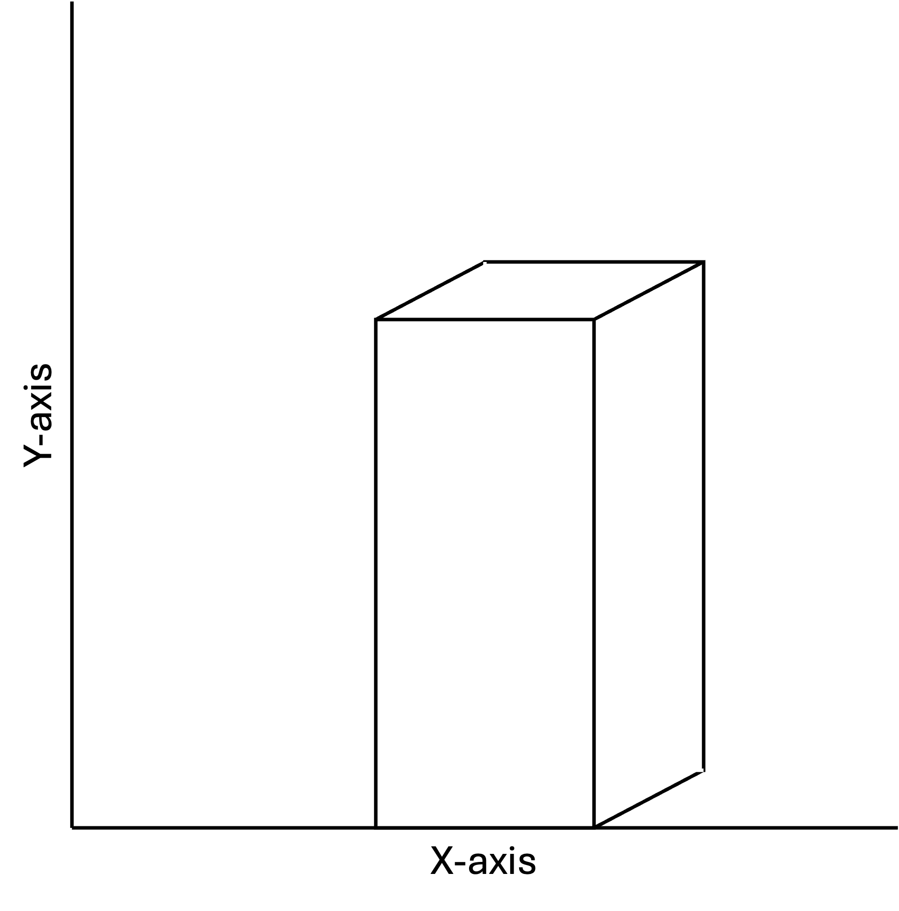{#fig-bar3d-4 fig-scap='Solid 3D bar'}

Construction of depth cues for a 2D bar chart. In some cases, bar are constructed such that the y-axis corresponds with the front face of the prism (as shown). Other 3D bar charts may have the y-axis aligned with the back face.
:::

The naming convention for these types of bar charts is not consistent. Many researchers in the visualization community call these 3D bar charts due to the portrayal of three-dimensional space [e.g., @zacks1998; @fischer2000]. Other times, the lack of information in the third dimension results in the charts referred to as 2.5D charts [e.g., @tractinsky1999]. To be consistent, we will refer to this style as "3D bar charts".

### Against 3D Bar Charts

@tufte2001 called the use of 3D elements a "fake perspective" in his description of "chart junk", which is where visual elements add clutter to the data visualization. Other researchers [@zacks1998; @stewart2009] have termed the perspective effect "extraneous" when referring to depth cues. The reasoning behind this is fairly intuitive: why include additional noise when simpler alternatives exist?

The seminal work of @cleveland1984 theorized that encoding information in volumes would provide worse numerical estimation than for encodings using positions, lengths, and areas. Their reasoning stems from Stevens' Power Law [@stevens], a psychophysics formulation that estimates a perceived stimulus magnitude $p$ with the actual magnitude $a$ by $p=ka^\alpha$. The estimation of $\alpha$ provides guidance as to which types of stimuli are most subject to distortion from their true scale when $\alpha=1$. @stevens estimated $\alpha$ to be approximately 1.1 for visual length and as low as 0.9 for visual area. While the 3D bar charts do not lose their 2D encodings, they do gain depth, and thus volume encodings. The effect of volume versus area comparisons was noted earlier by @croxton1932, where accuracy for ratio estimations was worse for cubes as compared to bars and circles. When considering the dimensionality, comparisons of lower dimensions tend to be less distorted to human perception than higher dimensions.

From an artistic point of view, depth cues can obscure some elements of the chart, resulting in a decrease in readability. For 3D bar charts, this often occurs from the volumetric elements partially covering the response axis. Consider @fig-skewed where the y-axis corresponds to the back face of the rectangular prism. In this case, the front and right faces do not directly correspond with the axis, thus making it more difficult to extract values from the chart.

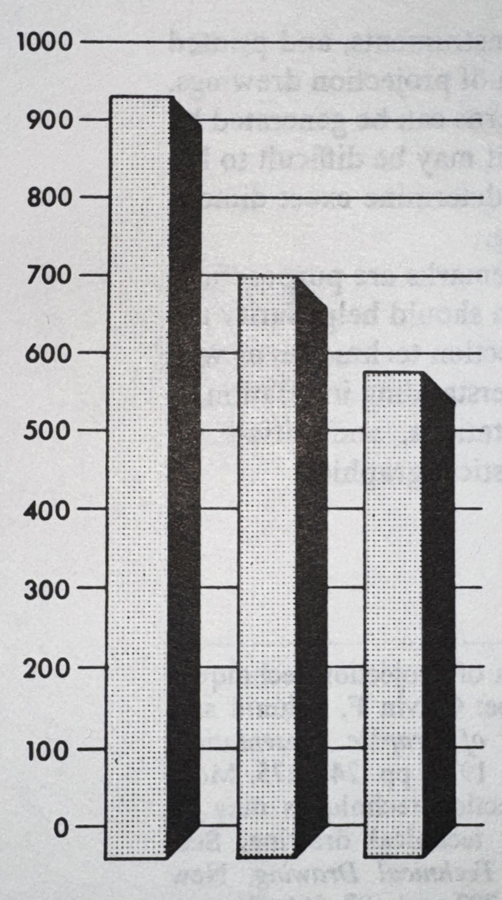{#fig-skewed width="3.35in" fig-scap='Skewed view overestimates bar heights'}

### For 3D Bar Charts

The primary motivations for using 3D bar charts are preference and memorability. @levy1996 argued that depth cues can be useful in these contexts. In three experiments involving over 100 psychology students, participants were asked to select from a set of 2D and 3D charts for different tasks. Their results suggested that students more often preferred 3D charts when the goal was to enhance memory of the chart, while preferences were about evenly split between 2D and 3D when the task was to present information to others. @levy1996 also suggested that the depth embellishments in 3D graphics may boost memorability by making charts more visually distinctive.

The primary motivations for using 3D bar charts are preference and memorability. Embellishments through the use of 3D elements could be interpreted as more impressive, and thus better for the final polished chart. If the chart is visually appealing, it may increase the memorability by having those distinctive elements. A study of chart tasks was conducted by @levy1996, where it was suggested that 3D charts are preferred for these reasons. Another study conducted by @fisher1997 suggested similar preferences. In each of these studies, 2D charts were preferred for extracting information, and approximately half of participants preferred 3D charts for displaying information. @levy1996 speculated that the preference for 3D charts was to make the displays stand out to the viewer and thus more memorable.

The idea of 3D charts increasing memorability aligns with broader findings on “chart junk,” where non-data elements are suggested to aid recall of information found in visualizations, though often at the cost of longer processing times [@bateman2010; @borgo2012; @peña2020]. Similar increases in processing time have been reported specifically for 3D bar charts [@siegrist1996; @fischer2000; @stewart2009]. The trade-off between information extraction and memorability provides some evidence that 3D bar charts may have context-specific roles in data visualizations.

The persistence of 3D bar charts reflects the influence of artistic preferences in visualization. The added depth can make results appear more striking, giving the impression of visual weight. Such embellishments often appeal to audiences by enhancing visual impact, even when they add little to the clarity of the data itself.

### Conflicting Empirical Studies

```{=html}
<!---
-   All the new articles from <https://measuringu.com/is-3d-worse-than-2d/>
-   @melodycarswell1991, should include this one!
-   @spence1990
--->
```

Although @tufte2001 argued against the use of 3D charts whenever possible, empirical studies involving direct comparisons of 2D and 3D bar charts have shown mixed results. In general, these studies focus on metrics of accuracy and find that 3D bar charts tend to be either less accurate or just as accurate as their 2D counterparts. Another common metric is response time, where 3D charts tend to have longer response times. Overall preference for one style of chart over another is a subjective measurement, but has shown mixed results for the two styles of charts.

#### Accuracy

Accuracy is a common metric in studies comparing 2D and 3D bar charts, typically measured by either extracting a single numeric estimate or making comparisons between two values. Here, the style of chart with lower errors are considered to be the better chart. Many studies used controlled environments for constructing stimuli, often displaying one or two stimuli at a time, or controlling non-target stimuli. In practice, charts are often more complex, displaying many stimuli without drawing attention to particular values.

When only measuring accuracy, 3D bar charts tend to be less accurate than their 2D counterparts [@zacks1998; @stewart2009]. However, this result is less prominent when introducing time delays [@zacks1998, Experiment 2] or easier task complexity [@stewart2009]. @siegrist1996 noted that bar positions and sizes also affected performance accuracy, emphasizing that other factors contribute to accuracy. It is also important to note that metrics of accuracy are not conclusive, where sometimes there is no evidence of a difference between 2D and 3D bar charts [@melodycarswell1991].

Of course, there are other less-studied factors that could affect perceptual judgments of accuracy in 3D bar charts. In addition to viewing parameters found in 2D bar chart studies [@fischer2005; @rice2024], adding depth cues are also subject to viewing angles, amount of depth, and field of view parameters. Viewing angle, with respect to the axis, can mislead the reader into overestimating or underestimating numerical quantities [@fig-skewed]. @zacks1998 did not find a significant effect for the amount of perception depth, but noted a trend such that increased exaggeration of depth lowered their accuracy metric. Lastly, field of view is fixed for the viewer, but can widely distort 3D renderings [@fig-fov]. These factors add additional complexity, but are not widely studied for the use of statistical graphics.

::: {#fig-fov layout-ncol="3" fig-scap="Field-of-view effects in 3D rendering"}
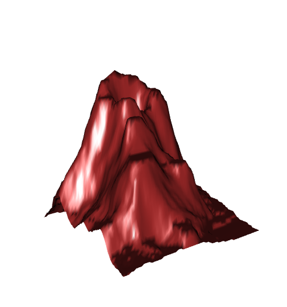{#fig-fov30 fig-scap='FOV 30 degrees'}

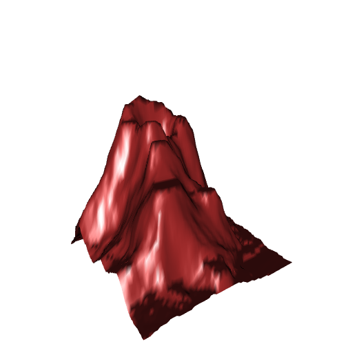{#fig-fov60 fig-scap='FOV 60 degrees'}

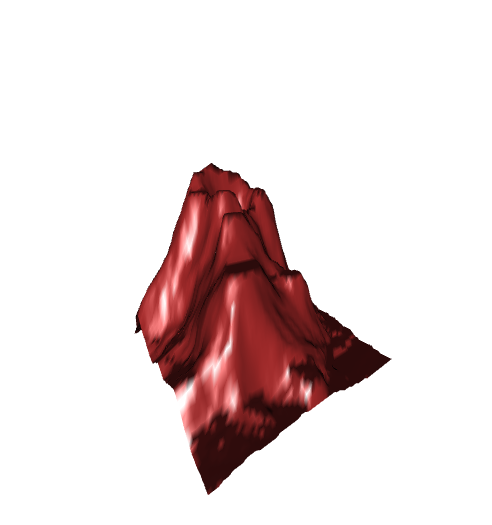{#fig-fov90 fig-scap='FOV 90 degrees'}

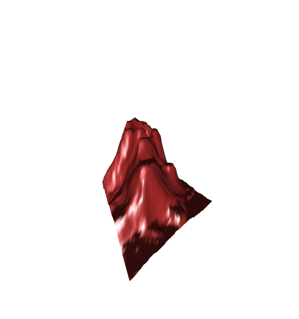{#fig-fov120 fig-scap='FOV 120 degrees'}

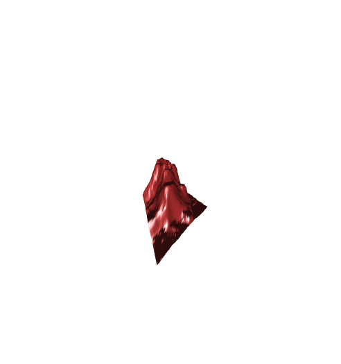{#fig-fov150 fig-scap='FOV 150 degrees'}

Multiple charts of the volcano dataset [@volcano] rendered using the `rgl` package [@rgl] in R. Each chart has a different field-of-view parameter, with the amount of distortion increasing as the field-of-view (FOV) increases.
:::

#### Response Times

The speed in making perceptual judgments is another common metric in studies comparing types of charts. In theory, charts where questions can be answered more quickly implies that the chart is better at communicating information. However, response time is a poor metric in situations of exploratory data analysis and long term interactions with complex graphics [@vanderplas2020]. When a question of interest is known in advance, response time becomes a more viable metric.

Depth cues from 3D bar charts tend to increase the amount of time required to answer questions [@siegrist1996; @fischer2000; @stewart2009]. Intuitively, additional complexity should require additional time to process. For 3D bar charts, viewers need to align the response axis with the rectangular prisms in order to determine the approximate magnitude of the bar. Consider @fig-skewed, where the y-axis denotes magnitude with respect to a hidden face of the bar. In order to extract a numerical quantity, the viewer first has to align the axis with the correct face of the prism before processing the magnitude. The additional interaction of mentally aligning with the chosen viewing parameters results in 3D charts needing additional time to process.

#### Preference

The debate between whether to use 2D or 3D graphics stems from a wider adoption of 3D charts in practice. Computer graphics have made it easy to produce charts of either dimensionality, resulting in creative liberties for the creation of the chart for publication. @fig-ag-bar showcases two examples of 3D bar charts from the 1978 Handbook of Agricultural Charts [@cdi_hathitrust_hathifiles_uva_x030492864] where other options exist for displaying the data. @schmid1983 (Chapter 8) also showcases many other 3D charts published in official reports. Evidently, the persistence of 3D bar charts has shown preferential use by maintaining a presence in many software programs, including the widely used Microsoft Excel.

::: {#fig-ag-bar layout-ncol="2" fig-scap="Published examples of 3D bar charts"}
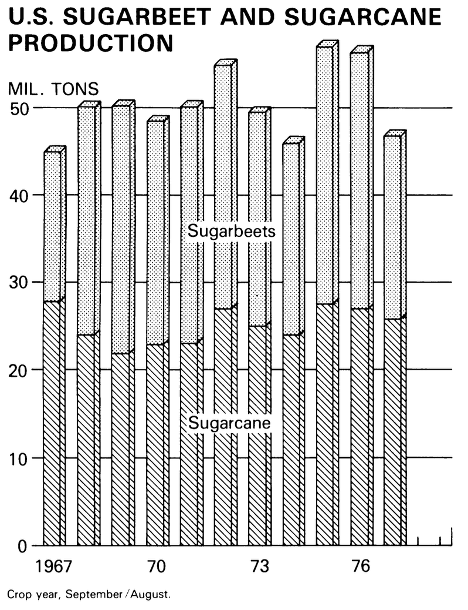{#fig-ag-bar-pos height="2in" fig-scap='Positive-value 3D bar chart'}

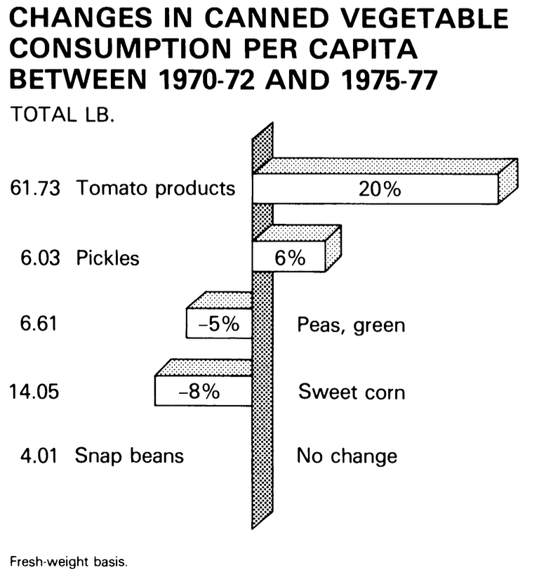{#fig-ag-bar-neg height="2in" fig-scap='Negative-value 3D bar chart'}

Two examples of 3D bar charts found in publication [@cdi_hathitrust_hathifiles_uva_x030492864]. This left image is a stacked bar chart, using shadings to indicate sugarbeats and sugarcane. The image on the right is a bar chart with positive and negative values of changes in canned vegetable consumption.
:::

Preference for data visualizations can be categorized into visual appeal and overall usefulness. Visual appeal is where perceptual tasks are not a priority, and the goal is to have an image that is pleasant to the viewer. Charts chosen for visual appeal may not accurately convey each individual observation, but rather emphasize key trends of the data or promote engagement with the visualization. Usefulness, on the other hand, is a rating of how effective the viewer thought the chart was for answering specific questions. This often comes in the form of comparing multiple values, where accuracy in the comparisons is an essential component of the chart. The purpose of the chart can be an influential factor in deciding which chart type to use for displaying a dataset [@levy1996].

<!-- Maybe a figure with media vs statistical graphic?  -->

When not tasked with estimating values, 3D bar charts tend to be more visually appealing [@levy1996; @fisher1997; @stewart2009]. This may be in part due to the forced illusion of depth which creates additional embellishments that would increase the impression and memorability of the chart, as seen by other types of Tufte's "chart junk" [@borgo2012; @peña2020]. Despite the visual appeal, 2D charts tend to be chosen for preference and ease of use when making numerical estimations [@levy1996; @stewart2009]. The contrast between the visual appeal of 3D bar charts and the utility of 2D bar charts is interesting to note since we would intuitively expect charts that are easier to read as being the optimal chart. This does not seem to be the case for the dimensionality of bar charts.

```{r}
#| eval: false #Never got this work nicely :(
#| layout-ncol: 2
#| label: fig-chart-preference
#| fig-cap: "Three examples of chart preference."
#| fig-scap: "Chart preference examples"
#| fig-show: 'hold'
#| out-width: 90%
#| out-height: 90%
#| fig-subcap: 
#|  - "3D volume chart"
#|  - "2D area chart"
#|  - "Much better alternative"

# Use Tufte's worst chart, 2D equivalent, and an actually good representation.
year <- 1972:1976
under25 <- c(72, 70.8, 67.2, 66.4, 67.0)
over25 <- 100-under25
middle <- under25 - over25
under25plot <- 100 - (middle + over25)
label <- factor(c('25 AND OVER', 'middle', 'UNDER 25'), levels = c('25 AND OVER', 'middle', 'UNDER 25'), ordered = T)
response <- c(over25, middle, under25plot)

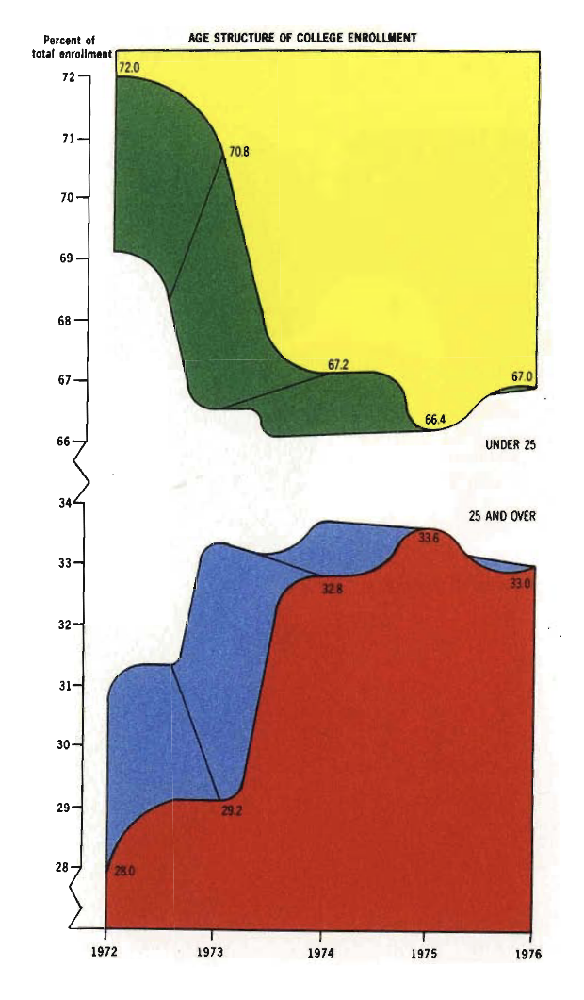

data.frame(year = rep(year, times = 3), label = rep(label, each = 5), response) %>% 
  # mutate(label = factor(label, levels = c('25 AND OVER', 'middle', 'UNDER 25'), ordered = T)) %>% 
ggplot(mapping = aes(x = year, y = response)) + 
  geom_area(mapping = aes(fill = forcats::fct_rev(label)), 
            color = 'black',
            outline.type = 'full') + 
  scale_fill_manual(values = c('25 AND OVER' = 'grey20',
                               'middle' = NULL,
                               'UNDER 25' = 'grey80'),
                    na.value = 'white') + 
  annotate("label", x = year, y = over25-5, label = over25, size = 2) + 
  annotate("label", x = year, y = under25+5, label = under25, size = 2) + 
  labs(x = 'Year', y = 'Percent Enrollment', fill = '',
       title = 'Age structure of college enrollement') + 
  theme_bw() +
  theme(panel.grid = element_blank(), aspect.ratio = 1060/620,
        plot.title = element_text(size = 5))

data.frame(year = rep(year, times = 2), response = c(under25, over25), 
  label = c(rep('UNDER 25', 5), rep('25 AND OVER', 5))) %>% 
ggplot(mapping = aes(x = year, y = response, color = label)) + 
  #geom_bar(stat = 'identity', position = position_stack()) + 
  geom_line(size = 2) + 
  geom_point(size = 4) + 
  scale_y_continuous(expand = c(0,0), limits = c(0,100)) + 
  labs(x = 'Year', y = 'Percent Enrollment', color = '',
       title = 'Age structure of college enrollement') + 
  scale_color_manual(values = c('25 AND OVER' = 'grey20',
                               'UNDER 25' = 'grey80'),
                    na.value = 'white') + 
  theme_bw() +
  theme(panel.grid = element_blank())
```

```{=html}
<!--# @zacks1998

-   Experiment 1: match height of bar from list of other bars

-   Experiment 2: Same as 1, but using memory

-   Experiment 3: Estimate ratio of two bars

-   Experiment 4: Same as 3, but varied the amount of depth

-   Experiment 5: Same as 3,4, but included new plot type that made bars by overlapping all volume faces -->
```

## Heatmaps in Research and Practice

When creating charts for three or more variables, it becomes increasingly complex to visualize data [@grinstein2001]. One option is to map the additional variables to aesthetics using gestalt principles [@vanderplas2020], which includes making use of color, size, and/or shapes to denote information. However, not every aesthetic is compatible with every type of variable. Color can be used to map either continuous variables with gradient scales or categorical variables with palettes. Size is typically reserved for continuous variables, where larger values correspond to a larger quantity. Shapes tend to have finite distinguishable representations in order to represent categorical variables. Examples of good and poor cases for each of these aesthetics are presented in @fig-gestalt.

```{r}
#| label: fig-gestalt
#| layout-ncol: 2
#| out-width: 90%
#| out-height: 90%
#| fig-cap: "Examples of color, size, and shape for scatterplots of the penguins dataset [@penguins]. "
#| fig-scap: "Gestalt channels in penguin scatterplots"
#| fig-subcap: 
#|   - "Color mapped to categorical variable."
#|   - "Size mapped to categorical variable."
#|   - "Shape mapped to categorical variable."
#|   - "Color mapped to continuous variable."
#|   - "Size mapped to continuous variable."
#|   - "Shape mapped to continuous variable."


theme_set(theme_bw())
library(palmerpenguins)
penguins %>% 
  ggplot(mapping = aes(x = bill_length_mm, y = bill_depth_mm, color = island)) + 
  geom_point() + 
  theme(aspect.ratio = 1)

penguins %>% 
  ggplot(mapping = aes(x = bill_length_mm, y = bill_depth_mm, size = island)) + 
  geom_point() + 
  theme(aspect.ratio = 1)

penguins %>% 
  ggplot(mapping = aes(x = bill_length_mm, y = bill_depth_mm, shape = island)) + 
  geom_point() + 
  theme(aspect.ratio = 1)

penguins %>% 
  ggplot(mapping = aes(x = bill_length_mm, y = bill_depth_mm, color = body_mass_g)) + 
  geom_point() + 
  theme(aspect.ratio = 1)

penguins %>% 
  ggplot(mapping = aes(x = bill_length_mm, y = bill_depth_mm, size = body_mass_g)) + 
  geom_point() + 
  theme(aspect.ratio = 1)

penguins %>% 
  mutate(body_mass_g = cut(body_mass_g, breaks = c(0, 3550, 4050, 4750, 6300))) %>% 
  ggplot(mapping = aes(x = bill_length_mm, y = bill_depth_mm, shape = body_mass_g)) + 
  geom_point() + 
  theme(aspect.ratio = 1) 
```

Heatmaps are a type of chart that can be used with two nominal or ordinal variables, and a continuous response variable. In two-dimensional formats, gradient fills are often used to denote the magnitude of the responses, utilizing a gradient scale. When represented in three dimensions, height is the primary mapping of the response of the heatmap. Due to the height aesthetic, 3D heatmaps are sometimes referred to as "height maps", particularly when spatial coordinates are involved. Since the color and/or height of the response variable can only be mapped once to each combination of x and y coordinates, heatmaps are generally used to summarize responses, such as averages or single-point observations. This makes heatmaps especially useful for visualizing patterns and trends across large datasets in a compact and interpretable format.

```{r}
#| label: fig-heatmap2d
#| fig-cap: "Heatmaps created with data from @national1977condition. The 2D heatmap represents the percentage of high school graduates participating in postsecondary education using a gradient color scale, whereas the 3D heatmap uses height. In each chart, there is an increasing association with postsecondary education with ability level and socioeconomical status."
#| fig-scap: "2D color versus 3D height heatmap encoding"
#| fig-subcap:
#| - "2D heatmap"
#| - "3D heatmap"
#| layout-ncol: 2


expand_grid(status = factor(c('High', 'Middle', 'Low'), ordered = T, levels = c('High', 'Middle', 'Low')),
            ability = factor(c('High', 'Middle', 'Low'), ordered = T, levels = c('Low', 'Middle', 'High'))) %>% 
  mutate(percent = c(81.2, 56.8, 31.4,
                     56.3, 31.8, 14.1,
                     47.2, 19.8, 8.7)) %>% 
  ggplot(mapping = aes(x = status, y = ability,
                       fill = percent)) + 
  geom_tile() + 
  geom_label(aes(label = glue::glue('{percent}%')),
             size = 3) + 
  labs(x = 'Socioeconomic status', y = 'Ability level', 
       fill = 'Participants as a percent\nof high school graduates', 
       title = 'Participation in Postsecondary Education of the\nHigh School Class of 1972: Fall 1974',
       subtitle = 'White') + 
  scale_y_discrete() +
  scale_fill_gradient(low = 'grey90', high = 'forestgreen', limits = c(0, 100), breaks = c(0,20,40,60,80,100)) + 
  theme(plot.title = element_text(hjust = 0.5),
        plot.subtitle = element_text(hjust = 0.5),
        aspect.ratio = 1)

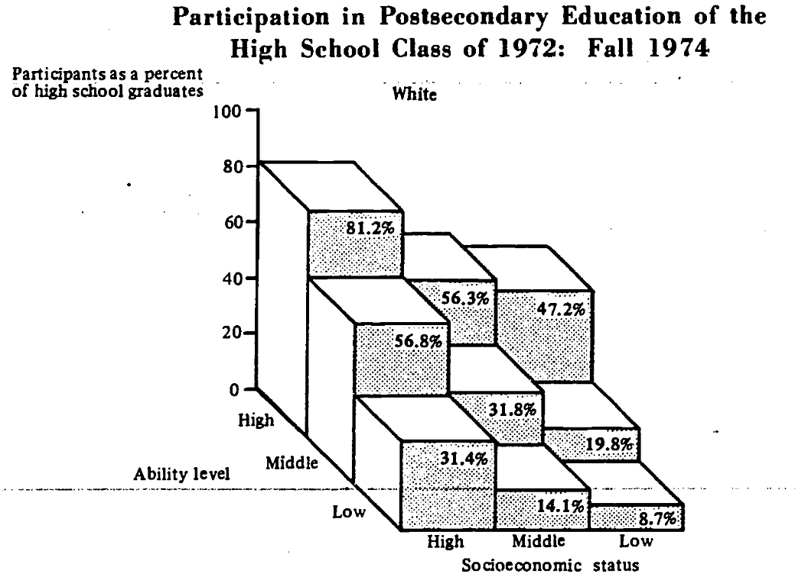
```

### Empirical Studies of 2D and 3D Heatmaps

Unlike 2D and 3D bar charts, the dimensional comparison for heatmaps has not been widely studied. This may be attributed to the complex designs of heatmaps, where there are many possible variables to consider. For example, the complex nature of color scales having an influential role in the perception of 2D heatmaps [@breslow2009; @liu2018; @reda2019]. It has also been observed that neighboring values may influence the ability to extract values, either by distraction or visual illusions [zacks1998; @vanderplasSignsSineIllusion2015]. The dimensionality of heatmaps requires the additional consideration of mapping color scales into heights, which is a process that has no literal translation. Depending on the scaling when mapping color to height, features may become overly smoothed or overly exaggerated. An example of this mapping discrepancy is shown in @fig-color-height. We expect that these numerous design choices contribute to the lack of research on 2D and 3D heatmaps.


::: {#fig-color-height layout-ncol="2" fig-scap="Height-scaling effects in 3D heatmaps"}
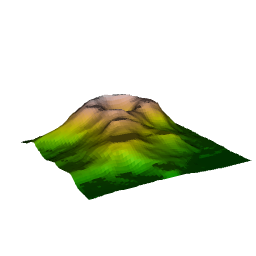{#fig-flat3d fig-scap='Compressed height scale'}

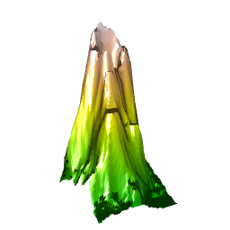{#fig-tall3d fig-scap='Expanded height scale'}

Two figures representing the volcano dataset [@volcano] using different height scaling factors. Both figures use the same color scale, but there is no "correct" translation of color into the measurable height.
:::

In 2D heatmaps, the choice of color palettes can influence the perception of numerical estimations [@liuSomewhereRainbowEmpirical2018; @molinalopezEffectColorPalettes2023; @zhangJustNoticeableDifference2023a]. Some gradient scales are easier to extract values from than others, and other gradient scales are better at displaying contrasts between values. Additionally, the use of colors requires accessibility considerations for people with color deficiencies. The relationship between color and 2D heatmaps possibly contributes to the difficulties of direct translations of 2D heatmaps into 3D heatmaps.

```{r}
#| layout-ncol: 4
#| label: fig-colorblind
#| fig-cap: "Effect of color deficiencies on the inferno palette from @viridis."
#| fig-scap: "Inferno palette under color-vision deficiencies"
#| fig-subcap:
#| - "Original palette"
#| - "Deutan (red-green)"
#| - "Protan (red-green)"
#| - "Tritan (blue-yellow)"


library(colorspace)
n <- 7
ref.pal <- viridis::inferno(n)

ggplot(mapping = aes(y = 1:n, x = 1, fill = ref.pal)) + 
  geom_tile() + 
  scale_fill_identity() + 
  theme_void() +
  theme(aspect.ratio = n, legend.position = 'none')

ggplot(mapping = aes(y = 1:n, x = 1, fill = deutan(ref.pal))) + 
  geom_tile() + 
  scale_fill_identity() + 
  theme_void() +
  theme(aspect.ratio = n, legend.position = 'none')

ggplot(mapping = aes(y = 1:n, x = 1, fill = protan(ref.pal))) + 
  geom_tile() + 
  scale_fill_identity() + 
  theme_void() +
  theme(aspect.ratio = n, legend.position = 'none')

ggplot(mapping = aes(y = 1:n, x = 1, fill = tritan(ref.pal))) + 
  geom_tile() + 
  scale_fill_identity() + 
  theme_void() +
  theme(aspect.ratio = n, legend.position = 'none')

```

Only a few studies have directly compared the dimensionality of statistical graphics [@kraus2020; @jeong2025]. Conducted primarily in virtual reality, these studies suggest that 2D and 3D charts each offer advantages depending on the task. Two-dimensional charts generally produced higher interpretation accuracy and better recognition of overall distributional patterns. In contrast, three-dimensional charts were more effective for estimating single values and supporting long-term recall. Taken together, these findings highlight dimensionality as an important consideration when selecting visual displays for specific analytic goals.

## State of Data Physicalization in 3D Statistical Graphics

While numerous studies explored the dimensionality of statistical graphics in 2D renderings, only a few studies empirically evaluated their effectiveness in 3D environments. @jansen2013b conducted one of the first studies with physical 3D heatmaps and focused on task completion times for estimations, suggesting that physical 3D heatmaps were better for extracting information. @jansen2013b also measured errors in estimations, but did not detect differences attributed to chart types. A series of experiments by Simon Stusak evaluated the memorability of digital and physical bar charts, which suggested that physical 3D bar charts may improve the ability to recall information [@stusakEvaluatingMemorabilityPhysical2015; @stusakIfYourMind2016]. To date, physical statistical graphics is a niche area in data visualizations and is largely unexplored.

## Methods for Evaluating Visualization Effectiveness

### What makes a good chart?

There are many aspects for designing good data visualizations. @vanderplas2020 discussed various approaches to testing graphics, including numerical estimations, speed, and error rates. These metrics are fairly common  to measure when comparing 2D and 3D charts [@croxton1932; @cleveland1984; @hughes], but they do not represent the full picture of what makes one type of chart better than another. As observed by @levy1996, the objectives of the chart can determine which type of chart should be used. While many metrics exist, the practical limitation of testing generally allows for only a few metrics to be tested at a given time.

Many studies involving statistical graphics tend to rely on numerical estimations for recommending data visualization practices. This is particularly useful given the role that data visualizations play in the understanding of underlying datasets, which is to understand data structures and relationships [@tukey1965]. Successful visualizations should be able to translate tables into figures that rapidly convey values and patterns found within the data structures. In this research, we focus primarily on numerical estimations while also recording task completion times. 

### Designing studies for numerical estimations

Many studies in graphical perception follow the same general format as @cleveland1984. Their work has been credited with over 2,500 citations, which indicates the importance of testing features of statistical graphics. Since 1984, the methods of analyzing and conducting studies on statistical graphics have evolved alongside statistical methods and technological progress [e.g., @hofmann2012; @vanderplas2020], but the structure of experimental designs involving numerical estimations tends to remain similar. Tasks typically involve the comparison of two stimuli, where the question is "how much bigger/smaller is one value compared to the other?" The phrasing of this question needs careful consideration since mental subtractive processes are perceived differently from mental ratio processes [@veit; @hagerty1978]. Our work, like many others in the InfoViz community, follow a procedure similar to @cleveland1984.

@cleveland1984 asked participants two questions when making comparisons between two values on a chart: which of the two values was the smaller, and what percentage the smaller was of the larger. The first question clarified if the participants were looking at the values correctly for the second question, and the second question is an estimation of $A/B$, where $A<B$. Accuracy was measured by $\log_2(|\text{True value}-\text{Estimated value}|+1/8)$, using the trimmed averages when bootstrapping confidence intervals. This measure of error was used to assess which type of chart was better and provided recommendations for how to display information. A replication performed by @heer2010 used Amazon's Mechanical Turk, which also found similar recommended chart features using a crowdsourcing platform. Many other studies tend to use similar types of questions when tasking participants to make numerical estimations.

When designing studies for numerical estimation, the choice of $A/B$ is an important consideration. Many researchers seemingly choose ratios in an arbitrary fashion or follow previously established work (e.g., @zacks1998 used the same ratios as @melodycarswell1991). Examples of ratios used in several studies are provided in @fig-ratios. However, the magnitude of stimuli and ratios are suggested to be a contributing factor to the amount of error in estimations [@cleveland1984; @zacks1998]. Additionally, participants may display an anchoring effect if the values are close to certain increments (e.g., estimating 55% as 50%). This suggests that the selection of ratios for estimation should cover a wide range of possible ratios.

Several calculations for error can be considered when estimating accuracy. The magnitude of error is calculated as $|\text{Guess}-\text{True value}|$, which is how far away a participant's estimate is from the target value. Removing the absolute value gives directional error, which allows for estimates to indicate bias of overestimation or underestimation. Since ratio estimations tend to be exponential [@veit], it is also common to use the logarithmic transformation, $\log|\text{Error}|$, to address non-normality for the magnitude of error. When reporting which chart type is more accurate in the extraction of information, the calculation of error needs to be clearly defined.

The type of estimation task can influence how participants respond with their estimates. Psychophysics has demonstrated that asking participants to estimate ratios elicits a different mental process than when asking participants to estimate differences [@veit; @birnbaumMeasurementMentalMap1978]. Estimations of ratios tend to fall on an exponential scale, where larger differences in stimuli result in smaller differences of estimated ratios. This makes $\log|\text{Error}|$ a natural choice for measuring ratio estimation tasks, similar to how @cleveland1984 measured error. Measurements of differences tend to be estimated linearly, where estimated differences are the same regardless of differences in stimuli. Modern statistical methodology is able to accommodate these linear and exponential relationships, as long as the estimation task is consistent for each trial.

```{r}
#| label: fig-ratios
#| fig-cap: "Ratios used by several studies"
#| fig-scap: "Ratios in prior graphical perception studies"
#| layout-ncol: 2
#| out-width: 90%
#| out-height: 90%
#| fig-subcap:
#| - "@cleveland1984"
#| - "@croxton1932"
#| - "@zacks1998, Experiment 1"
#| - "@zacks1998, Experiment 3"

# Graph showing the ratios used by C&M
library(tidyverse)
cm.ratio <- (c(17.8, 26.1, 38.3, 46.4, 56.2, 68.1, 82.5)/100)
croxton1932.ratio <- c(2, 12.5, 16.67, 25, 33.33, 50, 66.67, 70, 90)/100
zacks1 <- c(20, 40, 60, 80, 100)/100
zacks3 <- seq(1, 99, by = 7)/100

mycol <- "#d00000"

ggplot(mapping = aes(x = 1:length(cm.ratio), y = cm.ratio)) + 
  geom_col(fill = mycol, color = 'black') + 
  geom_text(aes(label = cm.ratio, y = cm.ratio + 0.05)) + 
  scale_y_continuous(limits = c(0,1.1), breaks = c(0, 0.25, 0.5, 0.75, 1)) + 
  theme_bw() + 
  labs(x = '', y = 'Ratio') + 
  theme(aspect.ratio = 1/2,
        axis.text.x = element_blank(), axis.ticks = element_blank(),
    panel.grid.major.x = element_blank(),
    panel.grid.minor.x = element_blank())

ggplot(mapping = aes(x = 1:length(croxton1932.ratio), y = croxton1932.ratio)) + 
  geom_col(fill = mycol, color = 'black') + 
  geom_text(aes(label = croxton1932.ratio, y = croxton1932.ratio + 0.05)) + 
  scale_y_continuous(limits = c(0,1.1), breaks = c(0, 0.25, 0.5, 0.75, 1)) + 
  theme_bw() + 
  labs(x = '', y = 'Ratio') + 
  theme(aspect.ratio = 1/2,
        axis.text.x = element_blank(), axis.ticks = element_blank(),
    panel.grid.major.x = element_blank(),
    panel.grid.minor.x = element_blank())

ggplot(mapping = aes(x = 1:length(zacks1), y = zacks1)) + 
  geom_col(fill = mycol, color = 'black') + 
  geom_text(aes(label = zacks1, y = zacks1 + 0.05)) + 
  scale_y_continuous(limits = c(0,1.1), breaks = c(0, 0.25, 0.5, 0.75, 1)) + 
  theme_bw() + 
  labs(x = '', y = 'Ratio') + 
  theme(aspect.ratio = 1/2,
        axis.text.x = element_blank(), axis.ticks = element_blank(),
    panel.grid.major.x = element_blank(),
    panel.grid.minor.x = element_blank())

ggplot(mapping = aes(x = 1:length(zacks3), y = zacks3)) + 
  geom_col(fill = mycol, color = 'black') + 
  geom_text(aes(label = zacks3, y = zacks3 + 0.05)) + 
  scale_y_continuous(limits = c(0,1.1), breaks = c(0, 0.25, 0.5, 0.75, 1)) + 
  theme_bw() + 
  labs(x = '', y = 'Ratio') + 
  theme(aspect.ratio = 1/2,
        axis.text.x = element_blank(), axis.ticks = element_blank(),
    panel.grid.major.x = element_blank(),
    panel.grid.minor.x = element_blank())
```

## Research Gaps and Study Motivation

It is generally advised to avoid using 3D data visualizations whenever possible, although previous studies often contradict this statement through mixed findings. The main contributing factor tends to be the role of the third dimension. When the third dimension is used for depth, 2D charts are generally preferred for better numerical extractions and quicker completion times. On the contrary, using the third dimension for displaying information can provide better estimates than 2D alternatives. In addition, 3D charts tend to be chosen for their ability to improve, or attempt to improve, the memorability of the data. This makes previous research inconclusive on a superior chart dimensionality.

Despite extensive study of graphical dimensionality, these findings are almost exclusively based on 2D projections presented on paper or digital displays. As a result, current recommendations may not generalize to contexts in which the third dimension is physically realized rather than visually implied. Physical charts allow for natural interactions and promote additional engagement with the data structures. However, current literature provides little guidance on the construction or effectiveness of physical charts.

In this research, we explore the the physical dimensionality of 2D and 3D statistical graphics. In Chapter 1, we explore the dimensionality of bar charts using a pilot study that partially replicates the work of @cleveland1984. We then expand the study in Chapter 2 as an experiential learning project for an undergraduate introductory statistics course and collect information on how students reflected on various parts of the scientific process. Chapter 3 takes the ideas of Chapter 1 and Chapter 2 and replaces bar charts with heatmaps. Collectively, this research provides the initial large-scale studies into physical statistical graphics, resulting in recommendations for the creation and use of tangible data visualizations.
